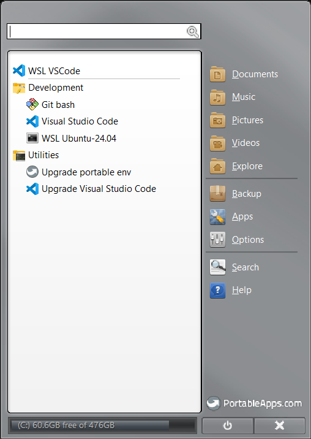

# Portable env

## Introduction

This project is a wrapper around [common-env](https://github.com/nmarghetti/common_env) that allows to define different profiles.

Each profile will define its own list of application/settings to install.

## Installation

1. **Download archive**

   - Create a folder `C:\PortableEnv`.
   - Download and extract `portable-env.zip` into that folder (ensure to extract only the files and not to have a portable_env folder).

   You should end up with the following structure:

   ```text
   C:/PortableEnv
    ├── certificates
    │   └── ...
    ├── ini.bat
    ├── settings
    │   ├── certificates
    │   │   └── ...
    │   ├── extra
    │   │   └── upgrade_portable_env
    │   │       └── ...
    │   ├── profiles
    │   │   └── ...
    │   └── vscode
    │       └── ...
    ├── setup_install.cmd
    └── setup_user.ini
   ```

1. **Add CA certificates to trust**

   If you need to add some CA certificates, create one or several subfolders in `C:/PortableEnv/certificates` and put them there.

1. **Update configuration**

   - Fill all fields in `setup_user.ini` (you can avoid the user if the one from the system is fine).

     ```ini
     [install]
     ; Profile to install, it will look for <profile>.ini and settings/profile/<profile>.ini
     ; eg. profile = dev
     profile =
     ; You can specify where are located the main portable env folder if you want to install it somewhere else
     ; common-env-apps-root=C:\PortableEnv
     ; portable-env-path=C:\PortableEnv\Documents\dev\portable-env
     ; You can also specify only one app and/or only one custom app. It can be useful if you want to install/upgrade only one and be fast.
     ; app-only = wsl_ubuntu
     ; custom-app-only = upgrade_portable_env
     [git]
     ; url to clone the repository with user and token, eg. https://<user>:<token>@github.com/owner/portable-env.git
     git-url =
     ; if left empty, it will be taken from your system
     user =
     ; put your email address
     email =
     ```

1. **Launch setup**

   Launch `setup_install.cmd` to install. You would have to run it several times and probably restart the computer if WSL has not been installed yet.

   You should end up with a folder like that:

   ```text
   C:/PortableEnv
   ├── AppData
   ├── Documents
   ├── home
   ├── PortableApps
   ├── extra
   ├── settings
   ├── ini.bat
   ├── PortableApps.exe
   ├── PortableApps.zip
   ├── PortableGit.exe
   ├── setup.cmd
   ├── setup.ini
   ├── setup_install.cmd
   ├── setup_user.ini
   ├── test.ini
   ├── test_setup.cmd
   └── Start.exe
   ```

   You can launch `Start.exe` to access to your portable env:

   

   You can also install many portable applications from PortableApps.com. To do so, you can just click on `Apps` --> `Get More Apps` --> `By Category` and select the applications you want to add (eg. Chrome, Firefox, Notepad++, OBS).

### WSL

1. Prerequisites

   - You need administrator rights, it will ask at some point during installation.
   - You need to be part of `Hyper-V Administrators` group to be able to create VHD drive (it is not created with admin rights). Go to `Computer manager` -> `System Tools` -> `Local Users and Groups` -> `Groups` and add yourself to the `Hyper-V Administrators` group.

1. Installation

   If you go with the dev profile, it will install WSL Ubuntu-24.04 with 2 VHDs:

   - Ubuntu-24.04 system under `C:\PortableEnv\PortableApps\Ubuntu-24.04\ext4.vhdx`
   - Your home under `C:\PortableEnv\home\wsl.vhdx` (which can be mounted in any WSL distribution)

   To run it you need to launch it from `WSL Ubuntu-24.04` under PortableApps interface as shown on the picture further above.

1. Configuration

   It is recommander to create file `%HOMEPATH%\.wslconfig` to customize WSL:

   ```ini
   # https://docs.microsoft.com/en-us/windows/wsl/wsl-config#configure-global-options-with-wslconfig
   [wsl2]
   memory=16GB # Limits VM memory in WSL 2 to 16 GB
   # processors=5 # Select number of virtual processors used by WSL 2 VM
   ```

1. Migration

   Migrate data from another WSL distribution to this one.

   ```shell
   # In a powershell ran as administrator

   # Locate the vhd to mount
   ls $env:LOCALAPPDATA\Packages\CanonicalGroupLimited*\LocalState\ext4.vhdx

   # List wsl distribution
   wsl --list

   # Mount the disk in the WSL distribution you want, eg. portable-Ubuntu-24.04
   wsl -d <PUT_THE_WSL_DISTRIBUTION> --mount --vhd <PATH_TO_ext4.vdhx> --bare
   ```

   ```shell
   # Under WSL

   # List available device
   lsblk

   # Create a path where to mount the volume (you can change the name)
   mkdir -p ~/wsl_ubuntu
   # Mount the device, eg. /dev/sde
   sudo mount /dev/<PUT_DEVICE_NAME_FOUND> ~/wsl_ubuntu

   # You can access the data from ~/wsl_ubuntu
   ls ~/wsl_ubuntu
   ls ~/wsl_ubuntu/home/$USER
   ```
